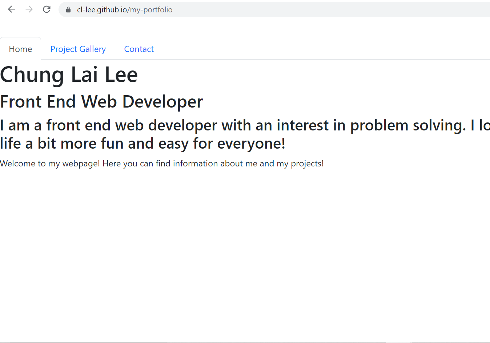
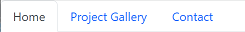

# My Portfolio Page

## Description
Welcome to the my [portfolio](https://cl-lee.github.io/my-portfolio) repo! This is a repo for my portfolio, where information about myself and my projects can be found.

This application was made using React.js.

## Prerequisites
A web browser is required to access the application.

## Usage
### Application link  
The application can be accessed through the following URL: https://cl-lee.github.io/my-portfolio.  
  

### Application usage
Visitors can click on the navigation bar items at the top of the page to navigate the website.

- #### Home
This page is about who I am, and a short description about myself.
    
- #### Project Gallery
This page contains information about projects I was involved in. Users can find the following information about the projects:
    - Project Title
    - GitHub link
    - Deployed link
    - A screenshot preview of the application

- #### Contact
    This is the contact page, where visitors can contact me through methods listed on the page.